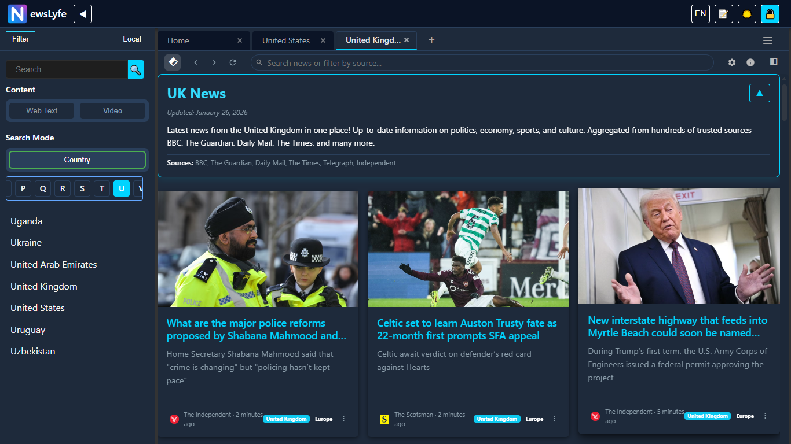

# NewsLyfe — News Workspace (Developer Preview)

  

<h1 align="center">NewsLyfe</h1>

  <strong>International News Aggregator &amp; Analyst</strong> 
  Chronological. Algorithm-free. Privacy-focused.

<!-- PITCH SZÖVEG -->

  NewsLyfe aggregates news from <strong>nearly 200 countries</strong>, allowing you to follow global events directly from sources in your own language. We do not rank or filter. You get total control over your information diet.

<!-- BADGES -->

  
  

<!-- 1. APP SZEKCIÓ (HERO KÉP) -->
<h2 align="center">📱 Mobile Experience</h2>

  

<!-- APP FEATURES -->
### ✨ Key Mobile Features
- 🌍 **Global Reach:** Content from nearly 200 countries.
- 🗣️ **Instant Translation:** Translate article previews with one tap.
- 🔔 **Smart Alerts:** Keyword-based notifications in 90+ languages.
- 🤖 **AI Analysis (Experimental):** Ask questions about articles for instant context.

 
 

<!-- 2. WEB/DESKTOP SZEKCIÓ (ELKÜLÖNÍTVE) -->
<h2 align="center">🖥️ Desktop Workspace</h2>

  The desktop version brings native software functionality to the browser for power users.

  

<!-- Visual Feed (átmenet) - teljes szélességű lila háttér kép -->

  

> Build your own, personal news hub.

---

## 🎯 Problem & Solution

The global news stream is chaotic and unmanageable with traditional tools. NewsLyfe organizes this information flood into a focused, high-performance workspace, giving users back control. Nearly 100,000 new articles arrive daily from almost 7,000 sources—all in a single, manageable interface.

**The platform is algorithmically neutral.** We do not rank, highlight, or remove news. Display is strictly chronological; content and freshness are the responsibility of the source domains. Our goal is to provide a clean, manipulation-free tool for users.

This is a web application that brings native software functionality to the browser. Responsiveness, customization, persistence, and modularity go far beyond what a typical website offers.

---

## ✨ Key Features

- ✅ **Tab-based Workspace:** Dynamically create, organize, and persist tabs—each representing a separate workflow (news feed, search, etc.).
- ✅ **Real-time Filtering & Search:** Instantly narrow results by country, language, and keywords using a filter pipeline.
- ✅ **Unified Interface:** Manage text articles and news videos from various sources on a single, clean interface.

---

## 🖼️ In Action

<table width="100%">
  <tr>
    <td width="50%" valign="top">
      

        <strong>Central Workspace</strong>
      

      
    </td>
    <td width="50%" valign="top">
      

        <strong>Real-time Filtering</strong>
      

      
    </td>
  </tr>
  <tr>
    <td colspan="2" align="center" valign="top">
       

        <strong>Advanced Customization</strong>
      

      
    </td>
  </tr>
</table>

*(The user interface is currently under active development.)*

---

## ⚙️ Technology Stack

The platform is designed for performance and scalability. Central state management is handled by a custom, tab-based logic (`TabController`), ensuring modular and efficient operation.

**Highlighted stack:**
- **Frontend:** React
- **State management:** Context API, `TabController`
- **Local storage:** IndexedDB (for workspace persistence)
- **Desktop version:** Electron
- **Mobile platforms (in preparation):** iOS & Android

---

## 🚀 Development Status & Roadmap

The project is currently in active development. Top priorities:

- [ ] **MVP Functionality:** Stabilize and test core features.
- [ ] **Tab-based Workflow:** Refine tab creation, deletion, and organization.
- [ ] **Filter Pipeline:** Optimize and expand filtering and search logic.
- [ ] **Bugfixes & UX Polish:** Ongoing improvements based on user feedback.

---

## 🤝 Contribution & Feedback

This repository is open for public testing and bug reporting. Contributions are primarily internal at this stage.

**Feedback and bug reports are welcome via GitHub Issues.** Every comment helps us improve the software.

---

## 📜 License & Contact

The project license can be found in the `LICENSE` file. (Currently: Proprietary)

For questions, open an [Issue here](https://github.com/newslyfe/newslyfe-demo/issues), or email us at [newslyfe.team@gmail.com](mailto:newslyfe.team@gmail.com).
