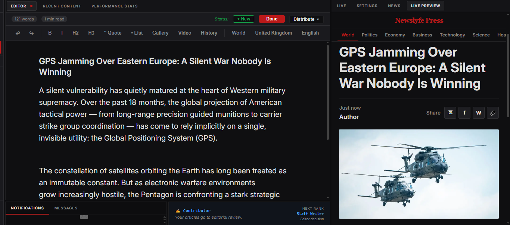

# NewsLyfe Press

> Real-time global news from 190+ countries — and a professional editorial workspace to write, review, and publish from anywhere.

**Live demo:** [newslyfe.github.io/newslyfe-press](https://newslyfe.github.io/newslyfe-press/)

A real-time global news infrastructure built from tens of thousands of daily sources, creating a unified chronological global news feed. The platform combines global news aggregation, a geopolitical hotspot map, and a professional editorial workspace where users can create reports and publications from live events — on mobile or web. Follow the news — or write your own story.

  

<a href="https://newslyfe.com/how-it-works">Write in the editor. See the result live.</a>

  

  

---

## What is NewsLyfe Press?

NewsLyfe Press is a real-time global news platform combining three core experiences:

- **Global News Feed** — 100,000+ articles/day from 7,000+ sources across 190+ countries, in strict chronological order
- **Intelligence Map** — Live OSINT map with conflict zones, military bases, nuclear sites, and satellite imagery (ArcGIS + Sentinel Hub)
- **Editorial Workspace** — Write, review, and publish articles from live events — on mobile or web

## Key Features

- 🟢 Real-time feed — RSS, Telegram, X, Reddit, YouTube, Hacker News, DEV
- 🗺️ Interactive OSINT map with deep data layers
- 🌍 190+ countries in a single chronological feed
- 🔔 Keyword alerts in 90+ languages
- 🌐 Built-in translation (Google, DeepL, Microsoft)
- 🔊 Text-to-speech
- 🤖 AI article summaries
- 🚫 No algorithm — true chronological order

## Platforms

- 📱 Android — [Google Play](https://play.google.com/store/apps/details?id=com.newslyfe.mobile)
- 🖥️ Web — Public beta

## Contact

📧 [newslyfe.team@gmail.com](mailto:newslyfe.team@gmail.com)
