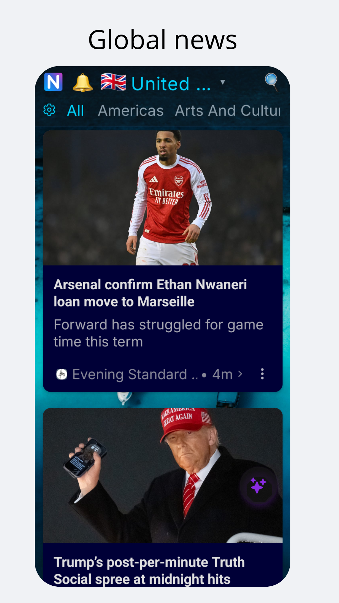
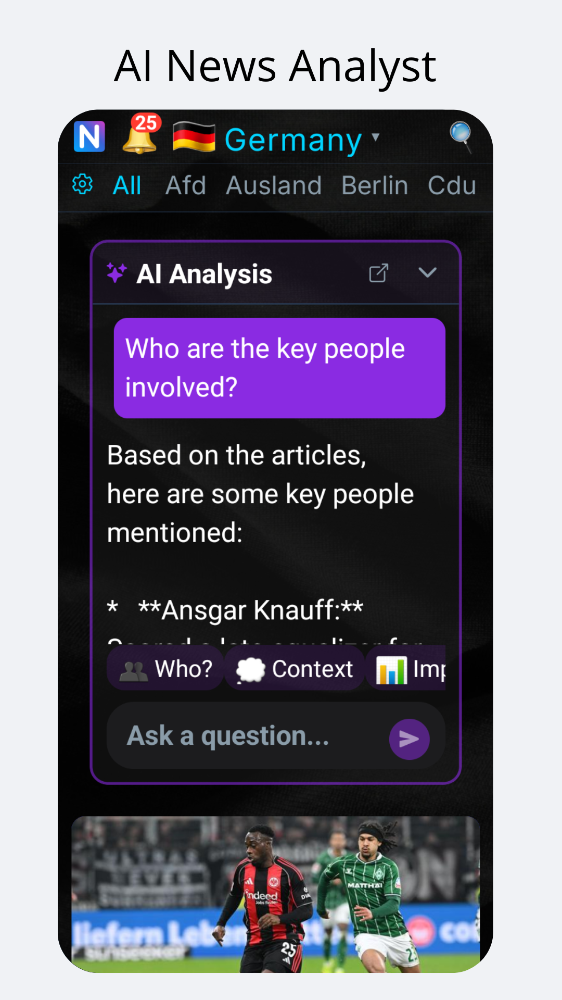
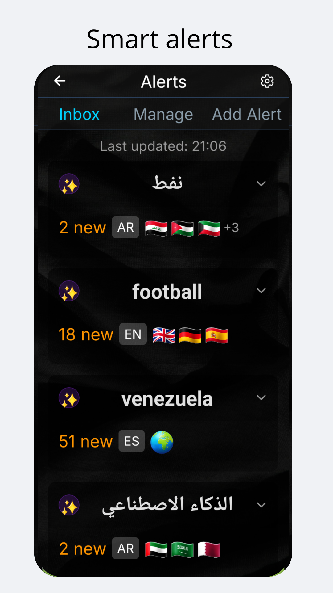
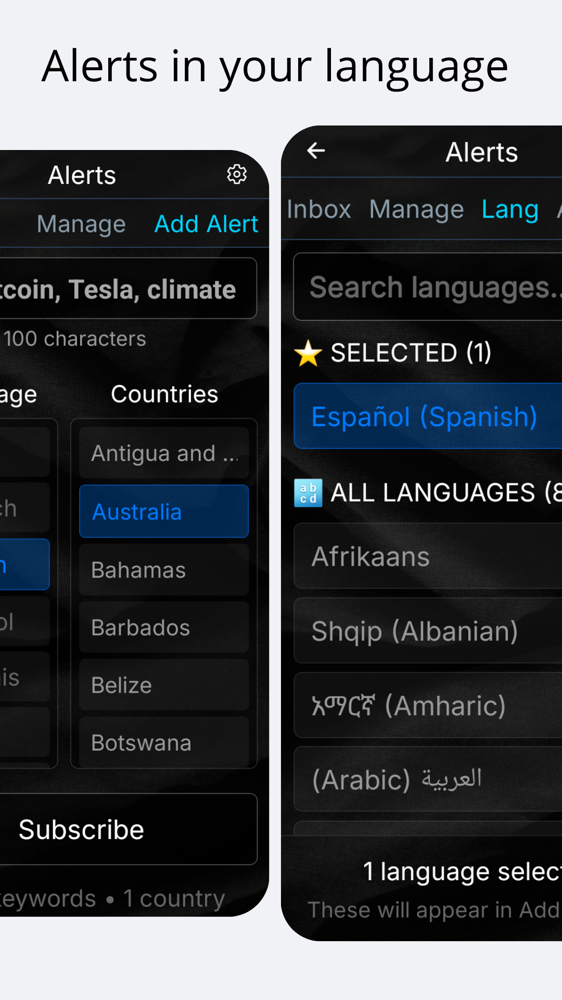

# NewsLyfe

  

International news aggregator and analyst. Over 100,000 articles within a 24-hour window, from nearly 7,000 sources across ~200 countries.

**Core principle:** Chronological display, no algorithms. Full control over your news feed.

**Tech:** React, IndexedDB, tab-based workspace. Android app (stable) + Desktop (beta).

//----------------------  eddig kész!!!////////////////

---

## Problem

- 7000+ sources, 200 countries, 90+ languages — fragmented and unmanageable
- Existing aggregators use algorithms that hide, rank, or filter content
- No single interface for global news without manipulation

## Solution

- Chronological-only feed with client-side filtering
- 100k+ articles in rolling 24h window, zero algorithmic manipulation
- Real-time translation + keyword alerts in 90+ languages
- One interface, all sources

//----------------------  Problem + Solution KÉSZ!!!////////////////

---

## Technical Implementation

**Client-side architecture for algorithmic neutrality:**
- IndexedDB stores 100k+ articles locally — no server-side ranking or tracking
- Tab-based workspace with persistent state across sessions
- Privacy by design: zero profiling, all filtering client-side

**90+ language support:**
- Real-time translation engine
- Keyword alerts in any language

**Performance at scale:**
- Virtualized lists + lazy loading handle massive feeds
- Incremental indexing without UI blocking
- Smooth scrolling through thousands of articles

**Why not server-side?** Zero manipulation means zero server-side ranking. Client-side filtering = user control.

//----------------------  Technical Implementation KÉSZ!!!////////////////

---

## Platforms

### 📱 Mobile (Android) - Stable Release

  

  
  
  
  

**Key features:**
- 🌍 Global reach: 200 countries
- 🗣️ Instant translation with one tap
- 🔔 Smart alerts in 90+ languages
- 🤖 AI analysis (experimental)

---

### 🖥️ Desktop (Web/Electron) - Public Beta

  

**Key features:**
- Tab-based workspace with persistent state
- Advanced filtering by country, language, keyword
- Bulk operations and saved searches
- Native desktop performance via Electron

//----------------------  Platforms KÉSZ!!!////////////////

---

## Technology Stack

- **Frontend:** React + Context API
- **Storage:** IndexedDB (client-side persistence)
- **State:** Custom `TabController` for tab management
- **Platforms:** Android (stable) + Desktop Web/Electron (beta) + iOS (planned)

---

## 🚀 Development Status & Roadmap

The project is currently in active development. Top priorities:

- [ ] **MVP Functionality:** Stabilize and test core features.
- [ ] **Tab-based Workflow:** Refine tab creation, deletion, and organization.
- [ ] **Filter Pipeline:** Optimize and expand filtering and search logic.
- [ ] **Bugfixes & UX Polish:** Ongoing improvements based on user feedback.

---

## 🤝 Contribution & Feedback

This repository is open for public testing and bug reporting. Contributions are primarily internal at this stage.

**Feedback and bug reports are welcome via GitHub Issues.** Every comment helps us improve the software.

---

## 📜 License & Contact

The project license can be found in the `LICENSE` file. (Currently: Proprietary)

For questions, open an [Issue here](https://github.com/newslyfe/newslyfe-demo/issues), or email us at [newslyfe.team@gmail.com](mailto:newslyfe.team@gmail.com).
